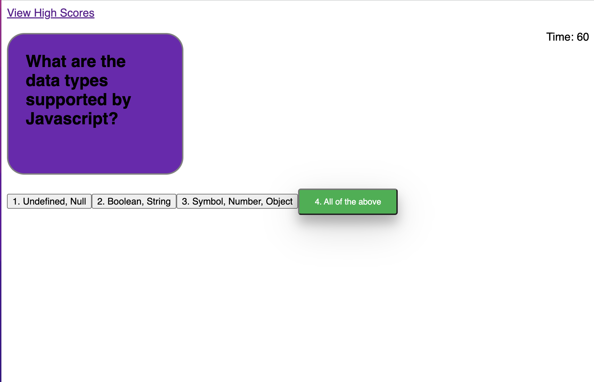

# Coding-Speed-Quiz :memo: :pencil:
A cool speed quiz to test your javascript knowledge!

## Descritpion 
I have built a timed quiz to help developers sharpen their coding knowledge. The quiz consists of " " multiple choice questions. A set time of " " is given and time will decrement as quiz progresses. The correct answer is displayed if the wrong choice is selected.

### What I used! 
- html 
- css
- javascript 

#### Demo

##### Author 
https://github.com/Ashmo91388